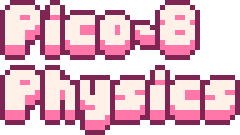
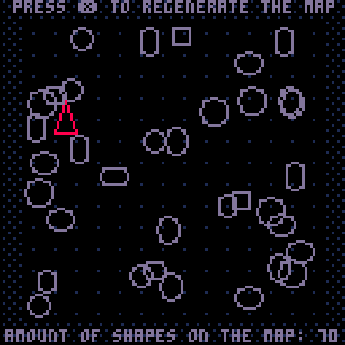

An implementation of the rigid body physics for [PICO-8](https://pico-8.com/) fantasy console. It works with different shapes: ovals, rects, and an arbitrary convex polygons. This library also provides tools for handling collisions between physics bodies, including collision shapes layers.

## Library demo

The source code is available under `./demo`

